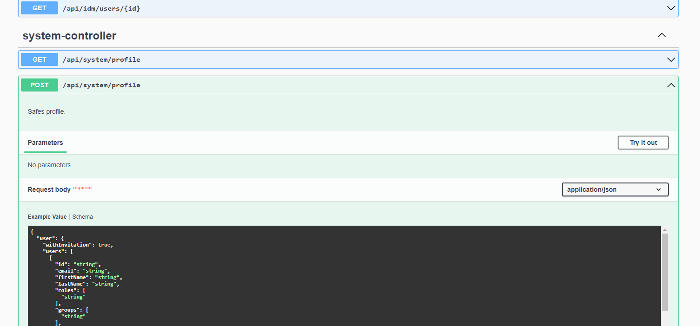
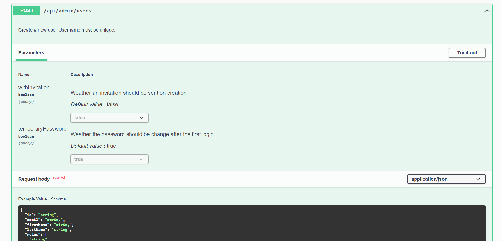
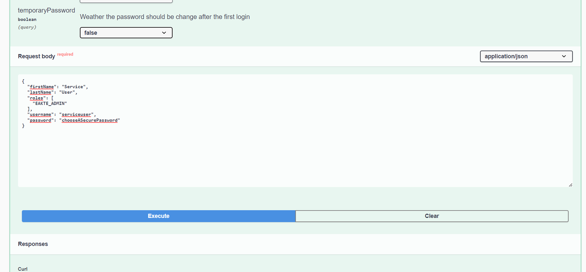
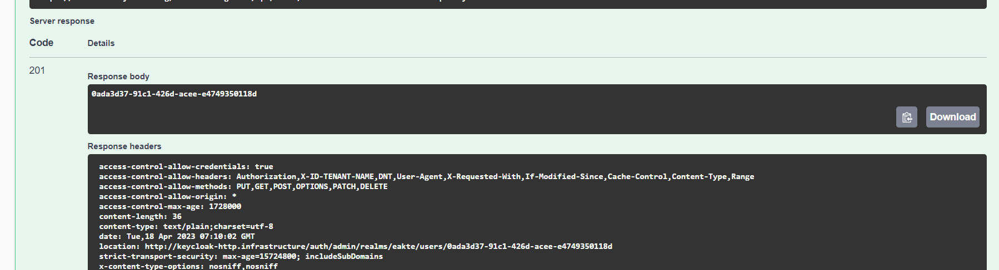

# E-Akte Momentum App installieren
## Vorbedingungen

**Achtung**

Eine mit der E-Akte kompatible Yuuvis Momentum Version muss davor installiert sein.

## Tenant Management vorbereiten
Um Tenants mit dem tenant-management erstellen zu können muss zuerst ein Profil angelegt werden. In diesem Profil werden die Rollen beschrieben die in einem neuen Mandanten zur Verfügung stehen sollen. Des Weiteren können Tenant-Admin Nutzer und Mail Einstellungen vorbelegt werden

Ein Profil kann z.B. mit Hilfe der swaggerUi unter `/tenant-management/swagger-ui.html` mit `POST /tenant-management/api/system/profile` hinterlegt werden.

Das Profil ist hier dokumentiert [https://help.optimal-systems.com/yuuvis\_develop/display/YMY/Tenant+Creation+Profile](https://help.optimal-systems.com/yuuvis_develop/display/YMY/Tenant+Creation+Profile).



**Beispiel Profil**

```json
{
  "user": {
    "withInvitation": false,
    "users": [
      {
        "email": "changeme",
        "firstName": "Tenant",
        "lastName": "Admin",
        "roles": [
          "YUUVIS_TENANT_ADMIN",
          "EAKTE_USER",
          "EAKTE_USER_READ",
          "EAKTE_USER_WRITE",
          "EAKTE_ADMIN"
        ],
        "username": "tenantadmin",
        "password": "changeme",
        "enabled": true,
        "createdTimestamp": 0,
        "temporaryPassword": true
      }
    ]
  },
  "roles": [
    {
      "name": "EAKTE_ADMIN",
      "description": "Enables to be admin for all eakte objects of the tenant"
    },
    {
      "name": "EAKTE_USER",
      "description": "Enables read access to the fileplan and tenant settings"
    },
    {
      "name": "EAKTE_USER_READ",
      "description": "Enables to search and read all permitted eakte objects of the tenant"
    },
    {
      "name": "EAKTE_USER_WRITE",
      "description": "Enables to write all permitted eakte objects of the tenant"
    }
  ],
  "email": {
    "host": "changeme",
    "from": "changeme",
    "username": "changeme",
    "password": "changeme",
    "fromDisplayName": "E-Akte Admin",
    "port": 587,
    "enableAuthentication": true,
    "enableSSL": false,
    "enableStartTLS": false
  },
  "general": {
    "displayNameHTML": "<div class=\"yuv-brand-logo\">${DISPLAY_TENANT_NAME}</div>",
    "defaultLocale": "de",
    "supportedLocales": ["de", "en"]
  }
}
```

## E-Akte App in Momentum installieren

**Konfiguration und Service Account für die E-Akte anlegen**

Der authentication-internal Service muss in Kubernetes im Namespace yuuvis erstellt sein. Dies ist der Standard in Yuuvis ab der Spring 2023 Version.

Einen Crosstenant User-Account einrichten mit Rolle `EAKTE_ADMIN`:

[https://yuuvisdevelop.atlassian.net/wiki/spaces/YMY/pages/320049416/Cross-Tenant+Service+Accounts](https://yuuvisdevelop.atlassian.net/wiki/spaces/YMY/pages/320049416/Cross-Tenant+Service+Accounts)

Dafür muss ein neuer Mandant/Tenant mit der Tenantmanagement-Api angelegt werden, welcher für die mandantenübergreifenden Funktionen genutzt wird.
Ein Tenant kann über das tenant-management mithilfe der `POST /tenant-management/api​/system​/tenants` Schnittstelle erstellt werden. Z.B. über die SwaggerUI unter `/tenant-management/swagger-ui.html`.

Ein Mandant kann z.B. mit Hilfe der swaggerUi unter `/tenant-management/swagger-ui.html` mit `POST /api/system/tenants` erstellt werden.

1. Swagger UI `/tenant-management/swagger-ui.html` aufrufen und sich in einem bestehenden Mandanten mit einem Nutzer der die Rolle `YUUVIS_SYSTEM_INTEGRATOR` besitzt anmelden. Um den Mandanten auswählen zu können empfiehlt es sich ein Icognito Fenster zu verwenden.
2. Schnittstelle `POST /api/system/tenants` auswählen
3. Try it out klicken und den Tenant im Body konfigurieren. 
Beispiel Request Body um einen Tenant anzulegen:
```json
{
  "name": "testtenant",
  "description": "Test",
  "displayNameHTML": "Test",
  "adminPassword": "changeme",
  "adminEmail": "intern@optimalsystems.de"
}
```
4. Execute klicken
5. Unter responses server response body sollte nun der Statuscode 201 stehen. Dies bedeutet das der Tenant erfolgreich angelegt wurde.

Danach kann entweder im Keycloak oder über die entsprechende Tenantmanagement Schnittstelle ein Nutzer erstellt werden, welcher die Rolle `EAKTE_ADMIN` besitzt.

Für das anlegen des Nutzers in der Tenant Management API wird die Vorgehensweise im folgenden beschrieben:

1. Swagger UI `/tenant-management/swagger-ui.html` aufrufen und sich dabei im erstellten mandantenübergreifenden Tenant anmelden. Um den Mandanten auswählen zu können empfiehlt es sich ein Icognito Fenster zu verwenden.
2. Schnittstelle `POST /api​/admin/users` auswählen 

3. Try it out klicken und den Nutzer im Body konfigurieren. Zusätzlich temporaryPassword auf false setzen, da das den Nutzer verwendene System kein neues Passwort generieren kann.
Beispiel Request Body um einen Nutzer anzulegen:
```json
{
  "firstName": "Service",
  "lastName": "User",
  "roles": [
    "EAKTE_ADMIN"
  ],
  "username": "serviceuser1",
  "password": "chooseASecurePassword"
}
```


4. Execute klicken
5. Unter responses server response sollte nun der Status code 201 erscheinen und die ID des Nutzers.


6. Die ID des Nutzers und der Name des Tenants müssen in die authentication-prod.yml eingetragen werden. Dazu muss die Konfigurationsdatei authentication-prod.yml im Konfigurationsgit (gitea) geöffnet werden. Hier wird ein neuer Eintrag am Ende hinzu gefügt der folgende Form hat:

```yaml
authorization.serviceAccounts:
  - account: 'services-mandant\ddffd2d5-5dc5-494a-b706-2250cefee60a'
```
Statt `services-mandant` muss der Name des Mandanten eingetragen werden, in dem der Nutzer erstellt wurde. Statt `ddffd2d5-5dc5-494a-b706-2250cefee60a` muss die ID des Nutzers aus Schritt 5 eingetragen werden.
7. Eine leere application-eakte.yml unter yuuvis-config im Masterbranch auf der obersten Ebene anlegen und den in 3. Schritt erstellten User unter service-user eintragen. Zusätzlich muss hier das bei der Installation in den values unter eakte.db.password angegebene Passwort für die Datenbank eingetragen werden.
```yml
momentum:
  service-user:
    name: service_user
    password: Serv1ceUser1!
    tenant: servicestenant
eakte:
  db:
    password: changeme
```
8. Nach dem Speichern müssen der config und authentication neugestartet werden:
```bash
kubectl -n yuuvis rollout restart sts configservice
kubectl -n yuuvis rollout restart deployment authentication
```

## Die E-Akte App Routen freischalten

In der `authentication-prod.yaml`

Die eakte unter routing.endpoints hinzufügen

Zu `authorization.accesses` folgendes hinzufügen

`- endpoints: /eakte/**`

Bei `routing.defaultEntryPoint` /eakte/index.html setzen

configservice, authentication und api neustarten.
```bash
kubectl -n yuuvis rollout restart sts configservice
kubectl -n yuuvis rollout restart deployment authentication
kubectl -n yuuvis rollout restart deployment api
```

## E-Akte Helm Charts installieren

Git auschecken:

[https://github.com/OPTIMALSYSTEMS/eakte-helm-charts](https://github.com/OPTIMALSYSTEMS/eakte-helm-charts)

Helm-Repos hinzufügen:
```bash
helm repo add bitnami https://charts.bitnami.com/bitnami
```

Helm Dependencies updaten
```bash
cd eakte
helm dep up
cd ..
```

Beispiel Values File mit den wichtigsten Variablen, die im Helm Chart konfiguriert werden müssen:
[eakte-values.yaml](res/eakte-values.yaml)

E-Akte Values File anpassen changeme durch Passwort ersetzen

Bei accessKeyId und secretAccessKey die von OS vergebenen Credentials für den Feedback Service eintragen.

Bei imageCredentials müssen die von OS vergebenen Zugangsdaten zur Docker Registry eingetragen werden.

Bei yuuvis.systemAdmin muss ein Nutzer mit einer `YUUVIS_SYSTEM_INTEGRATOR` Rolle eingetragen werden, mit welchem die E-Akte App zu Momentum hinzugefügt wird.

Als StorageClass muss eine, in dem Cluster, verfügbare StorageClass ausgewählt werden und in der eakte-values.yaml eintragen.

E-Akte Namespace anlegen und helm Charts installieren 

`helm install eakte ./eakte -n eakte --create-namespace -f eakte-values.yaml`

## Update der E-Akte App
**Achtung** 

Immer prüfen, ob es mit der bereits installierten Yuuvis Momentum Version kompatibel ist.

Für ein Update der E-Akte App muss die gewünschte Helm Chart Version im git ausgecheckt sein.

Danach kann die E-Akte App mit folgendem Befehl aktualisiert werden:
`helm upgrade eakte ./eakte -n eakte -f eakte-values.yaml`

## E-Akte pro Tenant konfigurieren

[Dokumentation für den Setup eines Tenants in der eAkte](setup-eakte-tenant.md)

## Yuuvis Viewer verwenden

Aktuell, wenn OnlyOffice mit Embedded Office Connector nicht benutzt wird, wird der Yuuvis Viewer als Default, für alle Datenformate, im gesamten Cluster gesetzt. Dies kann in der `application-eakte.yaml` konfiguriert werden. Eine tenant-spezifische Konfiguration ist möglich beim Setup des Tenants.

## Embedded Office installieren

Embedded Office nach folgender Anleitung installieren
und darauf achten OnlyOffice und Dependencies wirklich in den namespace onlyoffice mit `-n onlyoffice` zu installieren.

[https://gitlab.ecmind.ch/open/embeddedofficeservice\_momentum\_helm/-/wikis/home](https://gitlab.ecmind.ch/open/embeddedofficeservice_momentum_helm/-/wikis/home)

Folgendes Roleset in die embeddedoffice App installieren

[office-roles.xml](res/office-roles.xml)

Den OnlyOffice documentserver dabei mit folgenden Parametern konfigurieren

`helm install -n onlyoffice documentserver onlyoffice/docs --set securityContext.enabled=true --set persistence.size=1Gi --set jwt.secret=changeme`

Im Konfigurations git in der Datei application-eakte.yaml folgendes hinzufügen:

```yml
eakte:
  useOnlyOffice: true
```
