# Setup eines Tenants in Keycloak
## Voraussetzung
*   Keycloak ist installiert
*   Ein Mandant für die E-Akte ist angelegt. (Für unseren Beispielfall wurde bereits der Mandant **Kommunephoenix** angelegt.)
*   Du hast Benutzernamen und Passwort für den Administratoren-Account. (Die Credentials werden bei der Installation von Keycloak konfiguriert.)

Hier findest du die nötigen Anleitungen, falls nicht alle Voraussetzungen erfüllt sind:

*   [Keycloak installieren](https://help.optimal-systems.com/yuuvis_develop/display/YMY/Installing+and+Configuring+Keycloak+as+an+Identity+Provider)
*   [Anlegen eines Mandanten inklusive Administratoren-Account](setup-eakte-tenant.md)

  

### System Rollen anlegen

1.  Melde dich über die Administration Console von Keycloak als Admin an.  
    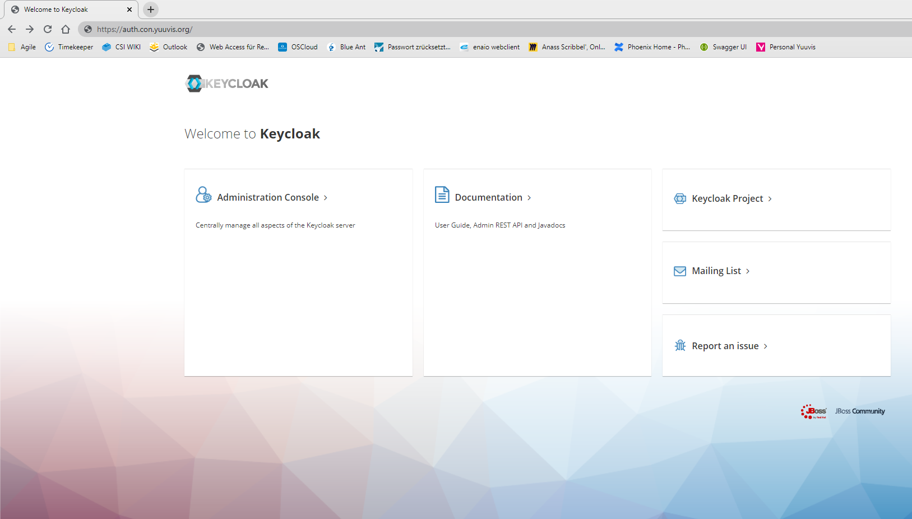  
      
    
2.  Die Realms bilden die einzelnen Tenants (Mandanten) in der Administration Console ab. Wähle hier den richtigen Mandanten aus. In unserem Fall ist das **Kommunephoenix**. 
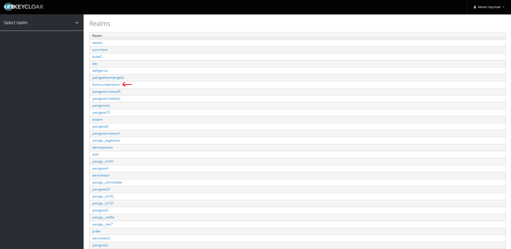  
    
3.  Füge folgende Systemrollen hinzu, falls diese nicht automatisch durch das Tenant-Management angelegt wurden:
    *   `EAKTE_ADMIN`
    *   `EAKTE_USER`
    *   `EAKTE_USER_READ`
    *   `EAKTE_USER_WRITE`
    *   `EMBEDDEDOFFICE` (Wenn EmbeddedOffice benutzt wird)   

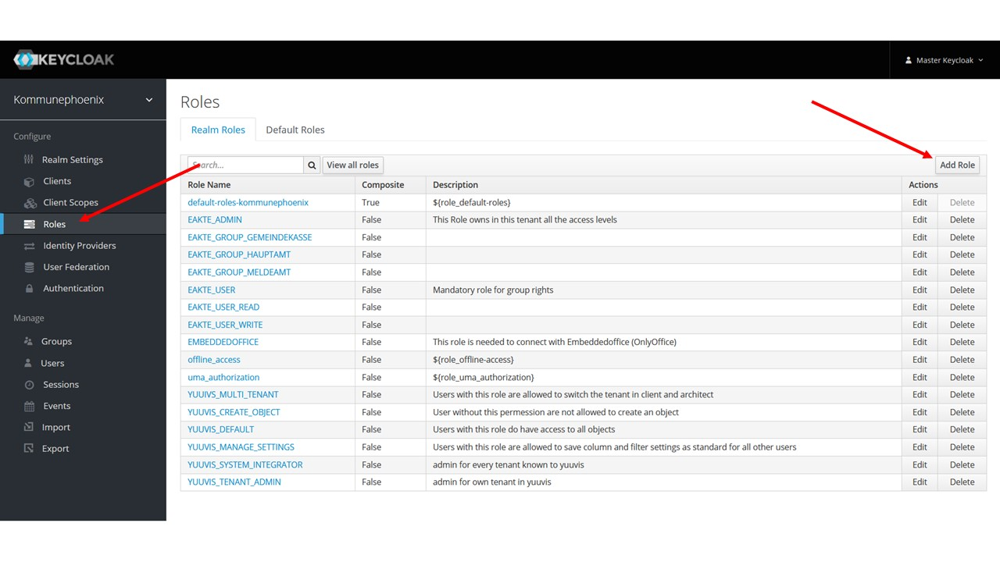

4.  Lege folgende Systemrollen als **Default Roles** fest:  
    *   `EAKTE_USER`
    *   `EAKTE_USER_READ`
    *   `EAKTE_USER_WRITE`
    *   `EMBEDDEDOFFICE` (Wenn EmbeddedOffice benutzt wird)
    
    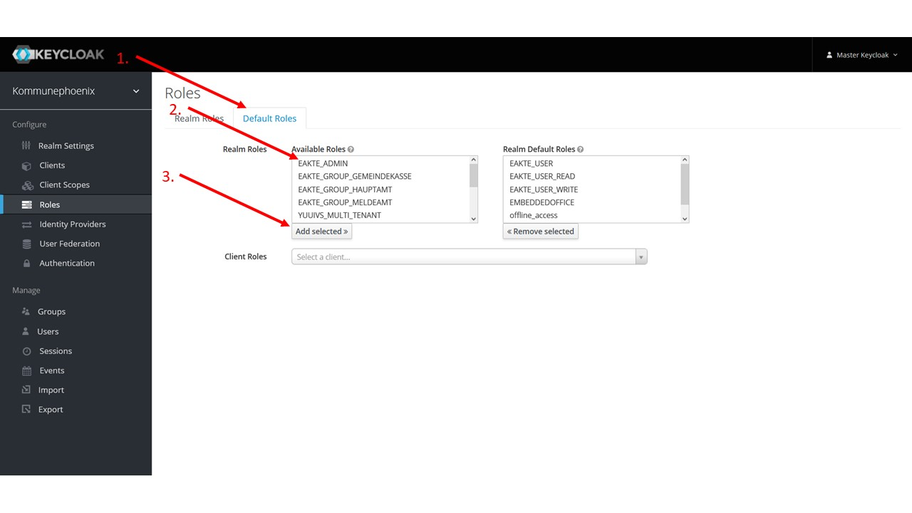

5.  Erstelle einen User mit Systemadmin-Privilegien.
    1.  Lege einen neuen User an.  
          
        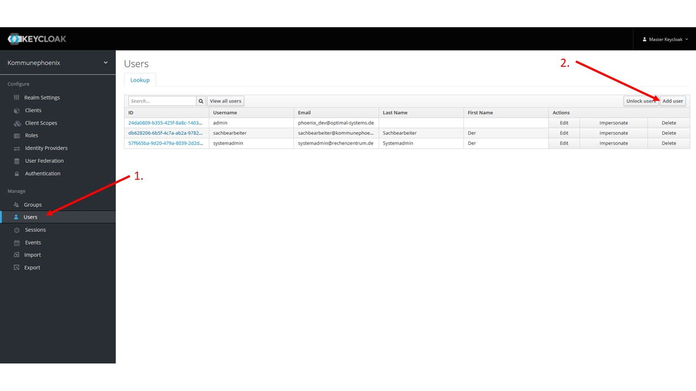
    2.  Gib dem Nutzer einen sprechenden Namen, z. B. `Systemadmin`. Klicke anschließend auf **Save**.  
        
        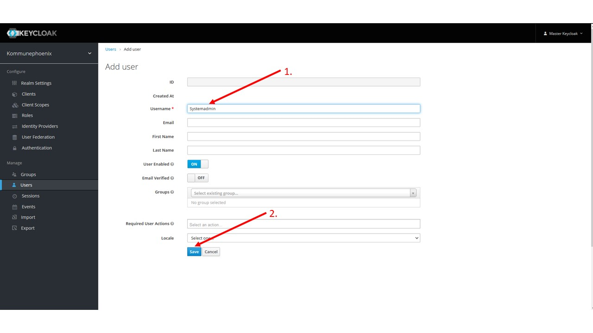

    3.  Füge dem neuem Nutzer folgende Rollen hinzu:
        *   `YUUVIS_TENANT_ADMIN` - Admin for own tenant in yuuvis
        *   `YUUVIS_SYSTEM_INTEGRATOR` - Admin for every tenant known to yuuvis   
        
        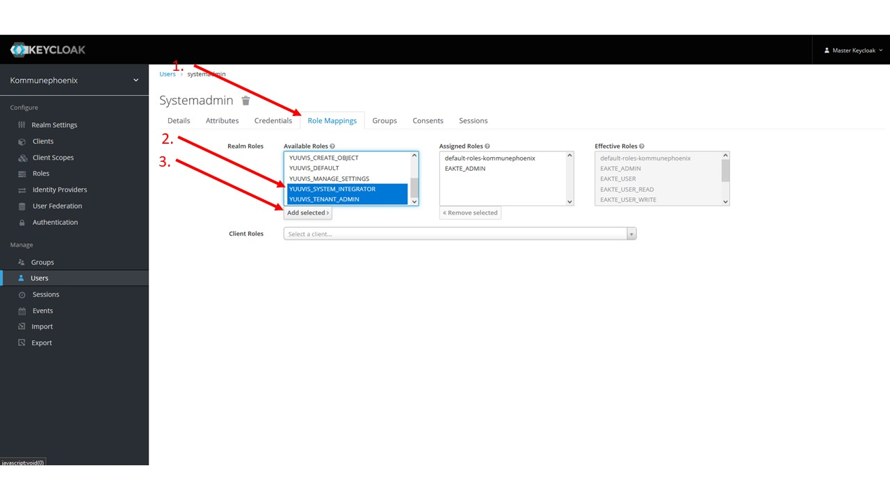

## Gruppen, Rollen (Berechtigungen) sowie User anlegen
Für die **Kommunephoenix** benötigen wir weitere Rollen für die Erstellung der einzelnen Gruppen. Diese werden für das Berechtigungssystem gebraucht.

1.  Füge folgende Rollen hinzu:
    * `EAKTE_GROUP_GEMEINDEKASSE`
    * `EAKTE_GROUP_HAUPTAMT`
    * `EAKTE_GROUP_MELDEAMT`


2.  Erstelle folgende Gruppen:
    * `Gemeindekasse`
    * `Hauptamt`
    * `Meldeamt`

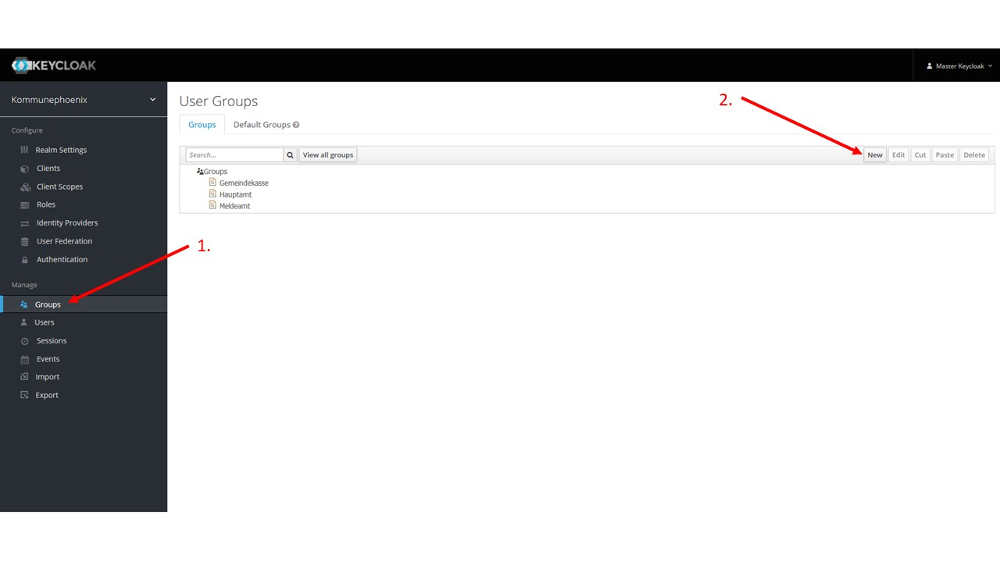

3.  Konfiguriere die Gruppe **Meldeamt**. (Die Gruppe **Meldeamt** dient hier als Beispiel. Die anderen Gruppen kannst du mit den gleichen Schritten den Anforderungen entsprechend konfigurieren.)
    
    1.  Wähle die Gruppe **Meldeamt** durch Doppelklick aus.  

    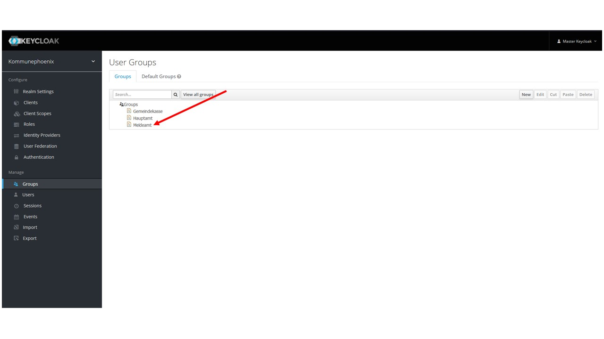
        
    2.  Navigiere zum Reiter **Role Mappings** und weise der Gruppe die in Schritt 1 erstellte Rolle `EAKTE_GROUP_MELDEAMT` zu.  

    
        
    3.  Optional: Navigiere zum Reiter Attributes und erstelle einen **Key** mit dem Titel "description". Füge als **Value** eine Gruppenbeschreibung ein. Die Gruppenbeschreibung wird Nutzern in der E-Akte angezeigt.  

    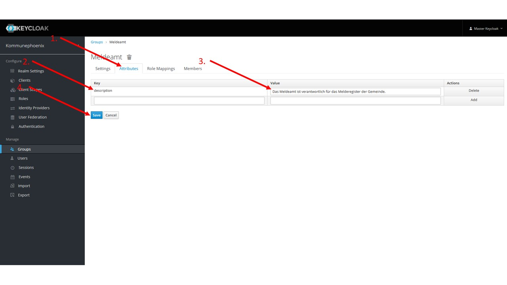
        
4.  Erstelle einen ersten Nutzer und weise ihn einer Gruppe zu.
    
    Hinweis:
    
    *   Jeder **USERNAME** muss innerhalb des Mandanten einmalig sein.
    *   Der Benutzer muss mindestens einer Gruppe zugewiesen werden oder die Rolle EAKTE\_ADMIN bekommen
    
    1.  Lege einen neuen User an.  
        
    2.  Gib dem Nutzer einen sprechenden Namen, z. B. `VornameNachname`, wähle die gewünschte Rolle aus und klicke anschließend auf **Save**.  
        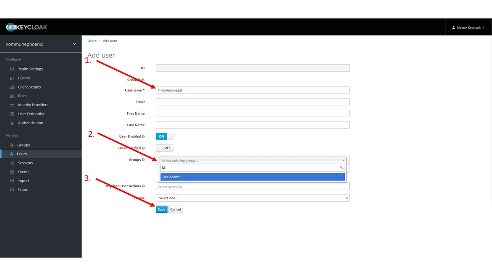

## Themes für den jeweiligen Tenant konfigurieren
**Achtung**

Das Template für das Produkt bedarf ebenfalls eine Anpassung in der Administration Console siehe untere Abbildung, diese setzt voraus, dass ein Template in der Installation von Keycloak mitberücksichtigt worden ist.

→ [https://www.keycloak.org/docs/15.0/server\_installation/#\_operator-extensions](https://www.keycloak.org/docs/15.0/server_installation/#_operator-extensions) & [https://www.keycloak.org/docs/15.0/server\_development/#\_themes](https://www.keycloak.org/docs/15.0/server_development/#_themes) für die Keycloak Version 15.0.2, welche wir aktuell nutzen.

**Infrastructure Values für das eAkte Keycloak Theme**

```yml
keycloak:
    imagePullSecrets:
      - name: dockeryuuvisorg
    extraInitContainers: |
        - name: eakte-theme-provider
          image: docker.yuuvis.org/eakte/eakte-infrastructure-ops/eakte-theme
          imagePullPolicy: Always
          command:
            - sh
          args:
            - -c
            - |
              echo "Copying theme..."
              cp -R /eakte-theme/* /theme
          volumeMounts:
            - name: eakte-theme
              mountPath: /theme
    extraVolumes: |
        - name: realm-config
          configMap:
            name: realmconfigmap
        - name: keycloak-tls-localhost
          secret:
            defaultMode: 420
            secretName: keycloak-selfsigned-tls-secret
        - name: db-creds
          secret:
            secretName: keycloakdb
        - name: kc-creds
          secret:
            secretName: keycloakuser
        - name: eakte-theme
          emptyDir: {}
    extraVolumeMounts: |
        - name: realm-config
          mountPath: "/realm/"
          readOnly: true
        - name: keycloak-tls-localhost
          mountPath: "/etc/x509/https/"
        - name: db-creds
          mountPath: /secrets/db-creds
          readOnly: true
        - name: kc-creds
          mountPath: /secrets/keycloak
          readOnly: true
        - name: eakte-theme
          mountPath: /opt/jboss/keycloak/themes/eakte
```

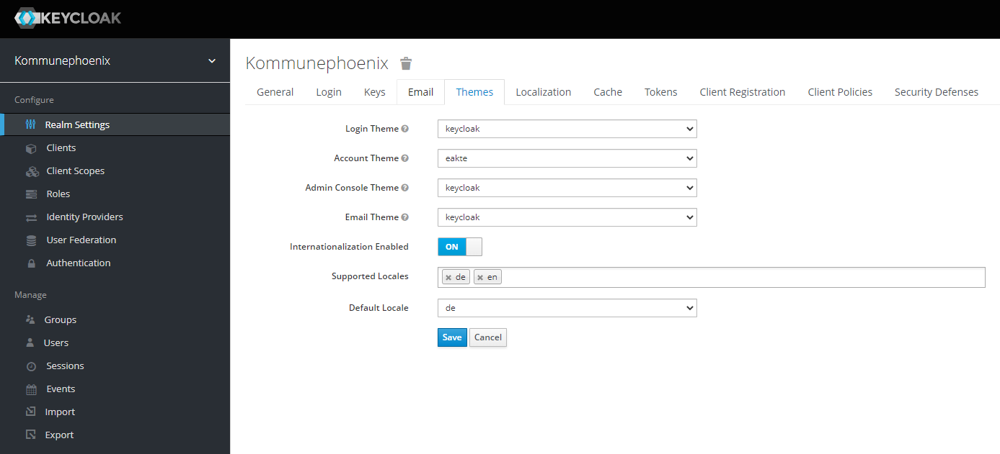