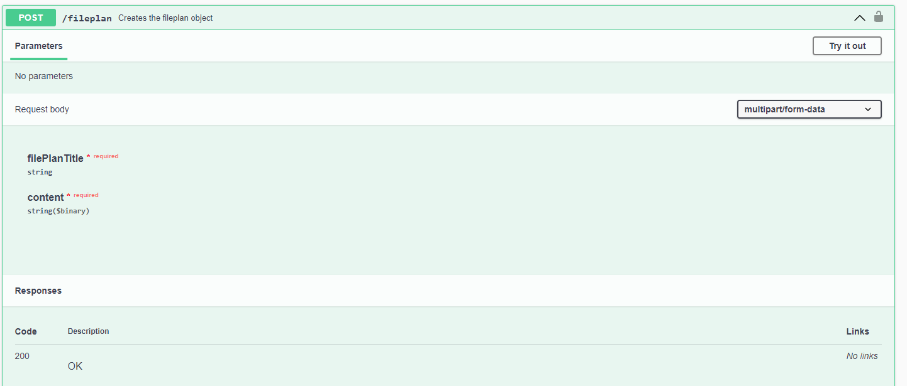

# Tenant einrichten
## Voraussetzung

Yuuvis Momentum Installation inklusive Tenant Management

Für die EAkte ab Version 1.5.0 wird die Yuuvis Momentum Spring Version 2023 benötigt.

## Tenant erstellen
Sobald ein Nutzer mit YUUVIS_SYSTEM_INTEGRATOR Rolle auf einem Mandanten erstellt ist, kann mithilfe des E-Akte Admin Tools ein neuer Tenant erstellt werden.

Dafür kann das Admin Tool über den Pfad  `{eigenerLinkFürMomentum}/eakte/admin/` aufgerufen werden.


Unter dem Menüpunkt Mandanten kann ein neuer Mandant über den erstellen Button erstellt werden. In den sich öffnenden Dialog können die Einstellungen für den neuen Mandanten vorgenommen werden.


Nach dem Klick auf Speichern wird nach kurzer Zeit eine Benachrichtung angezeigt, dass der Mandant erfolgreich erstellt wurde.

Über den Dropdown oben rechts kann der neue Mandant ausgewählt werden.

### Logo festlegen und weitere Einstellungen
Im Menü links Einstellungen wählen. Im oberen Bereich können Logos hochgeladen werden. Bisher sollten die Logos in den Auflösungen 40x40 und 80x80 Pixel vorliegen.
Das Logo in 40x40 muss später als 1x ausgewählt werden und das 80x80 Logo als 2x. Zukünftig wird ein Editor bereitgestellt der die Logos automatisch in den richtigen Auflösungen erzeugt.

Über den Erstellen Button kann ein Logo hinzugefügt werden.

In den Einstellungen können der Name des Mandanten, die Logos, Dokumententypen konfiguriert und die Integrationen aktiviert werden.

Weiter unten kann die Sprache des Mandanten festgelegt werden. Diese Einstellung gilt für alle Nutzer des Mandanten.

### Aktenplan importieren
Im Menü links Aktenplan wählen. Im Aktenplaneditor kann über den Import Button ein bestehender Aktenplan im JSON oder ein anhand der XLSX Vorlage [Aktenplan XLSX](res/Aktenplan.xlsx) erstellter Aktenplan importiert werden.
Danach kann der Aktenplan über den Button Speichern gespeichert werden.

### E-Akte App aktivieren
Dieser Schritt ist optional, da die App standardmäßig aktiviert ist und dies nur relavant ist falls man die verfügbaren Apps pro Tenant einschränken will.

Nach der Erstellung des Tenants muss man sich als Nutzer mit `YUUVIS_TENANT_ADMIN` Rolle anmelden und die E-Akte App aktivieren.

Dazu muss die App in den `/api/system/tenants/{{tenant}}/apps` aktiviert werden.

Dies kann mithilfe von Postman geschehen.

**Beispiel App-Konfiguration**

```xml
<?xml version="1.0" encoding="utf-8"?>
<apps xmlns="http://optimal-systems.org/ns/yuuvis/apps/"
    xmlns:xsi="http://www.w3.org/2001/XMLSchema-instance"
    xsi:schemaLocation="http://optimal-systems.org/ns/yuuvis/apps/yuuvis-core-apps.xsd">
    <app>
        <name>eakte</name>
        <state>enabled</state>
    </app>
    <app>
        <name>embeddedoffice</name>
        <state>enabled</state>
    </app>
</apps>
```

## Alternative Konfiguration mittels API
### Tenant erstellen

Ein Tenant kann über das tenant-management mithilfe der `POST /tenant-management/api​/system​/tenants` Schnittstelle erstellt werden. Z.B. über die SwaggerUI unter `/tenant-management/swagger-ui.html`.

Die einzelnen Optionen und Schnittstellen eines Tenants sind hier dokumentiert: [https://help.optimal-systems.com/yuuvis\_develop/display/YMY/Tenant+Management+Endpoints](https://help.optimal-systems.com/yuuvis_develop/display/YMY/Tenant+Management+Endpoints)

### Fileplan importieren

Es gibt drei Endpunkte um verschiedene Aktenplanformate zu importieren:

*   /fileplan-importer-api/xlsxToFileplan
*   /fileplan-importer-api/aktenplan21ToFileplan
*   /fileplan-importer-api/aktenplan21ZipToFileplan

Für den Import per xlsx soll folgende Struktur verwendet werden.

[Aktenplan XLSX](res/Aktenplan.xlsx)

Alle Varianten erlauben folgende Request Parameter beim Call des Endpunktes:

* `file`: Der Aktenplan als **xlsx** Datei (xlsxToFileplan), **xml** Datei (aktenplan21ToFileplan) oder **zip** Datei (aktenplan21ZipToFileplan)
* `storageLevel` (optional, Defaultwert: 0): Entscheidet ab welcher Ebene im Baum Akten angelegt werden können. Ebenen beginnen auf der untersten Ebene bei 1. Beispiel:
    *   Allgemeine Verwaltung (Ebene 1)
        *   Landkreis (Ebene 2)
        *   Gemeinde (Ebene 2)
            *   Gemeinderat (Ebene 3)

Bei Wert 0 kann überall abgelegt werden. Wird bspw. 3 als storageLevel gewählt kann erst ab der dritten Ebene abgelegt werden (Gemeinderat im Beispiel oben).

*   `omitLeafs` (optional, Defaultwert: false): Gibt an ob in der letzen Ebene im Baum immer abgelegt werden kann (false) oder nicht (true), egal welches storageLevel gewählt wurde.

Die erste Option (xlsxToFileplan) ist ein von uns vorgegebenes Excel Format. Hier sind zusätzlich folgende Parameter nötig:

*   `sheetName`: Der Name des relevanten Tabellenblatts in Excel
*   `titleColumnName`: Der Name der Spalte in der die Titel der einzelnen Ebenen stehen

  

Der hierbei erstellte Aktenplan kann zum Beispiel über die swagger-ui der E-Akte API hochgeladen werden.

Beispiel: [https://client.con.yuuvis.org/eakte/api/v1/swagger-ui.html](https://client.con.yuuvis.org/eakte/api/v1/swagger-ui.html)

Dort klickt man bei der Schnittstelle POST /fileplan auf Try it out, ergänzt den request body und drückt auf execute.



### Name und Wappen des Mandanten konfigurieren

Es gibt zwei Endpunkte um Namen und Wappen des Mandanten zu konfigurieren. Die Endpunkte können über die swagger-ui der E-Akte-API eingesehen werden `/eakte/api/v1/swagger-ui.html`:

*   `/settings`: Im Body als JSON können Name und der Pfad für das Logo angelegt werden:
    ```json
    {  
      "tenantName": "string",  
      "logoSrcSet": "string"  
    }
    ```
*   `/settings/logo/{filename}:` Logo für den Mandanten im JPG oder PNG Format mit dem angegebenen Dateinamen hochladen

## FAQs
1.  Kann ich mehr als einen Aktenplan in die eAkte importieren?
2.  Kann ich meinen Aktenplan editieren (z.B. Aktenplankennzeichen umbenennen oder neu gliedern)?
3.  Kann ich weitere Aktenplankennzeichen zu meinem Aktenplan hinzufügen?
4.  Kann ich die Ablageebene nach der initialen Einstellung bearbeiten?
5.  Was passiert mit meinen bestehenden Daten, wenn ich einen neuen Aktenplan importiere?

1. Derzeit darf nur ein Aktenplan pro Mandant existieren.
2. Ja über den Aktenplaneditor im Admintool ist dies möglich. Dabei sind die im Punkt 4 genannten Einschränkungen zu beachten.
3. Ja über den Aktenplaneditor im Admintool ist dies möglich
4. Ja über den Aktenplaneditor im Admintool ist dies möglich, allerdings führt ein ändern der Aktenplankennzeichen zu einem Verlust der Verknüpfung mit dem darin abgelegeten Daten. Diese können dann nur noch über die Suche gefunden werden und nicht über die Aktenplannavigation.
5.: Derzeit wird keine Prüfung vorgenommen wenn sich der Aktenplan ändert. Die bestehenden Daten ändern sich also nicht. Dies kann dazu führen, dass vorhandene Akten nicht mehr per Navigation durch den Aktenplan gefunden werden, wenn sich das dazugehörige  Aktenplankennzeichen geändert hat. Über die normale Suche sollen aber alle Objekte weiter gefunden werden.
